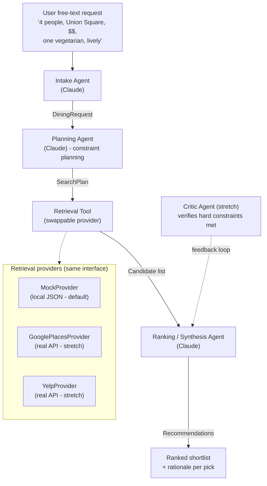

# GatherTable — Build Plan

> Multi-agent group dining planner. Originally built in NYU's Large-Scale Web
> Application course (2019); rebuilt in 2026 as an agent-first system.
>
> **Goal of this rebuild:** a presentable repo with clean, incremental commits,
> where every architectural decision is one I can defend in an interview.

---

## 0. What it is (positioning)

GatherTable helps anyone planning a meal together — from two people to a group —
agree on where to eat, by reconciling everyone's preferences instead of dumping a
raw search list. Going solo? It breaks decision paralysis with a guided spin.

- **Core users:** organizers and anyone wrangling a get-together (the everyday
  "where should we eat" problem).
- **2 people and N people are the same product** — same constraint-satisfaction
  engine, just fewer constraints. Two-person coffee/dinner pick is the N=2 case.
- **Solo mode is intentionally a *different* mode** — it solves decision fatigue,
  not conflict resolution, so it gets its own interaction (1 preference +
  weighted random). See Backlog. Not in scope for the first build.

---

## 1. What makes this more than a Yelp wrapper

The interesting problem is **reconciling conflicting preferences inside a group**
(one vegetarian, one wants steak, budget is `$$`, must be walkable from Union
Square). I model this as a constraint-satisfaction problem: hard constraints are
filters, soft preferences are weighted ranking criteria, and the planner makes
explicit tradeoffs. Retrieval (Yelp / Google Maps) is just a data source behind
a swappable tool interface.

---

## 2. Architecture

Four responsibilities, wired by a thin hand-written orchestrator (no LangGraph —
I want to own and explain the control flow).



This Mermaid block renders natively in the GitHub README — paste it straight in.

---

## 3. Typed contracts (the seams between agents)

Agents pass **Pydantic models, not raw strings**. This makes each stage
independently testable and the failure modes legible.

```python
# contracts.py
from enum import Enum
from pydantic import BaseModel

class Budget(str, Enum):
    LOW = "$"; MID = "$$"; HIGH = "$$$"; LUX = "$$$$"

class DiningRequest(BaseModel):          # Intake output
    party_size: int
    location: str
    budget: Budget
    cuisines_wanted: list[str]
    dietary_restrictions: list[str]      # HARD constraints
    soft_preferences: list[str]          # e.g. "lively", "good for groups"
    timing: str | None = None

class RankingCriterion(BaseModel):
    name: str
    weight: float                        # 0..1

class SearchPlan(BaseModel):             # Planning output
    must_satisfy: list[str]              # hard filters
    ranking_criteria: list[RankingCriterion]
    conflict_resolutions: list[str]      # how group conflicts were reconciled
    search_queries: list[str]

class Candidate(BaseModel):              # Retrieval output
    name: str; cuisine: str; price_level: Budget
    rating: float; address: str; distance_m: int
    attributes: list[str]                # tags: vegetarian_options, lively, ...

class Recommendation(BaseModel):         # Ranking output
    candidate: Candidate
    score: float
    rationale: str                       # why it fits + the tradeoff made
    constraints_satisfied: list[str]
```

---

## 4. Repo layout

```
gathertable/
  contracts.py
  orchestrator.py          # hand-written runner: intake -> plan -> retrieve -> rank
  cli.py                   # rich-formatted CLI demo
  agents/
    intake.py
    planning.py
    ranking.py
    critic.py              # stretch
  tools/
    retrieval.py           # Provider protocol + MockProvider + real stubs
data/
  restaurants.json         # mock dataset (~15 NYC spots, varied cuisine/price/tags)
tests/
  test_contracts.py
  test_retrieval.py
README.md
PLAN.md
.env.example               # ANTHROPIC_API_KEY, (GOOGLE_PLACES_API_KEY)
requirements.txt
```

---

## 5. Timeline

### MVP (~2.5h — done = presentable + pushable)

| Time | Task | Commit |
|------|------|--------|
| 0:00-0:20 | Repo init, `.gitignore`, `.env.example`, define the 4 Pydantic contracts | `chore: scaffold + contracts` |
| 0:20-0:40 | `MockProvider` + `data/restaurants.json` + retrieval tests | `feat: mock retrieval provider` |
| 0:40-1:20 | Intake, Planning, Ranking agents + orchestrator; end-to-end on mock data | `feat: end-to-end pipeline on mock data` |
| 1:20-1:50 | `rich` CLI output (request -> plan summary -> ranked shortlist) | `feat: cli demo` |
| 1:50-2:30 | README: architecture diagram, design decisions, run steps, roadmap; record demo GIF | `docs: readme + demo` |

### Stretch (toward 5h, by payoff)

1. Real **Google Places** or **Yelp Fusion** provider (keep mock as default so the demo never breaks)
2. **Critic agent** self-check: verifies all hard constraints are satisfied, loops back if not
3. Tiny **eval harness**: 5-10 scenarios + a rubric / LLM-as-judge score
4. **Streamlit** UI + demo GIF in README

---

## 6. Decision log (filled in as I built — this IS my interview script)

- **Why multi-agent vs single agent?** Each stage has a different job: intake
  normalizes free text, planning reasons about tradeoffs, ranking scores
  candidates. Splitting them lets me write a short, focused prompt for each
  and unit-test each one independently with a `FakeClient` fixture (no live
  API in the test suite). The tradeoff is real — 3 API round-trips instead of
  1, more tokens — and it would be the wrong call for a latency-sensitive
  consumer flow. For this product, the legibility wins.

- **Why typed contracts between agents instead of passing strings?** Pydantic
  v2 models give me four things for free: (1) `model_json_schema()` is the
  `input_schema` I hand to Anthropic's tool-use API, so I never write the
  schema twice; (2) `ValidationError` is what I feed back to the model on the
  one retry the structured-output helper allows, so the retry hint names the
  exact bad field; (3) construction is the test fixture; (4) failure modes
  are legible — if `weight` comes back as `1.5`, validation fails *here*, not
  twelve lines deeper in ranking. The seams are the contracts.

- **Why hand-written orchestrator instead of LangGraph?** The control flow is
  straight-line — intake, then planning, then retrieve, then rank. There's
  no graph. Hand-writing it keeps the dependency list to anthropic + pydantic
  + rich, and the whole runner fits on one screen. If a real branching loop
  shows up (the Critic agent, when it lands), I'll reconsider — but a
  framework for four sequential calls is overhead I'd have to explain away.

- **Why abstract retrieval behind a swappable provider?** The agents should
  not know whether candidates come from a JSON file, Google, or Yelp. A one-
  method `Provider` Protocol keeps the interface small (`search(plan) ->
  list[Candidate]`), `MockProvider` keeps the demo deterministic and offline,
  and swapping in a real API later is a constructor change. The
  `must_satisfy` prefix convention (`budget:$$`, `cuisine:italian`,
  `dietary:vegetarian`, bare tags) is the contract between planning and
  retrieval; the planning prompt is what teaches the model to emit it.

- **How I framed group preference conflict (constraint satisfaction):** Hard
  constraints become `must_satisfy` filters that retrieval enforces verbatim;
  soft preferences become weighted `ranking_criteria`; every tradeoff the
  planner makes lands in `conflict_resolutions` as a one-liner ("Group has a
  vegetarian, so we prioritized vegetarian_options over the steakhouse
  niche"). That trail is what makes the recommendation auditable instead of
  just an opinionated black box.

- **How I evaluated quality:** Offline — 23 unit tests covering contracts,
  the MockProvider filter convention, all three agents with a `FakeClient`,
  and the orchestrator end-to-end. Online — manual CLI runs against the
  canonical PLAN prompt. The first live run surfaced a real bug: rationale
  #1 framed 260m as "slightly further" while rationale #2 framed 80m's edge
  as "minimal" — internally inconsistent reasoning across picks. The
  ranking prompt produces each rec without seeing its siblings' rationales.
  This is exactly what the Critic agent (§5 stretch) is for: a cross-pick
  consistency check that loops back into ranking. The live run upgraded the
  Critic from "nice-to-have stretch" to "next thing I'd ship."

  A second live run — *"two people, quiet coffee in the East Village,
  cheap"* — caught a different class of bug: the planning system prompt
  described the `cuisine:` filter shape but never said "for each entry in
  `cuisines_wanted`, emit one." The planner emitted bare `coffee`, which
  MockProvider parsed as an attribute tag instead of a cuisine substring,
  so the shortlist came back empty. Fixed with one line in the planning
  prompt (mirror `cuisines_wanted` → `cuisine:<name>`, and an explicit
  "cuisine names never go as bare strings" rule). Same lesson as the
  consistency bug: live runs find what the test suite can't — the test
  suite asserts the helper retries on `ValidationError`; it can't assert
  that the prompt teaches the right vocabulary.

- **Where I let Claude Code drive vs where I made the call:** Claude
  scaffolded the package, wrote the tests, drafted the prompts, and wrote
  most of this README. I owned the calls that shape the product: model
  choice (Haiku 4.5 — these tasks don't need Opus, and it's cheaper/faster
  with no quality cliff for structured output); the `must_satisfy` prefix
  convention (so planning and retrieval share a vocabulary without a
  translator stage); refactoring the shortlist layout from one wide table to
  a compact comparison table plus per-pick rationale panels (the in-table
  rationale wrapped character-by-character in narrow terminals); and
  stopping after every commit for review rather than letting Claude run the
  whole MVP unsupervised.

---

## 6.5 Backlog / Ideas (one line each; promote to a real plan when I pick one up)

- **Solo mode:** 1 preference + weighted random ("spin"). Different interaction
  from the group flow — solves decision fatigue, not conflict resolution. Likely
  skips the Planning agent. Good "product breadth" stretch once the main path is solid.
- **Group voting / async input:** each person submits preferences separately,
  planner reconciles. Natural extension of the N-person engine.
- **Calendar / timing integration** (when, not just where).
- **Map view** of the shortlist.
- **Expand mock dataset:** current 15 NYC entries are biased toward Union
  Square / Flatiron with no coffee/café spots and no quiet East Village
  entries — surfaced by an N=2 live run that returned an empty shortlist.
  Add ~5 entries (cafés, East Village quiet spots, broader cuisine coverage)
  so casual smoke-test prompts don't fall off the dataset.

---

## 7. Working rule with Claude Code

The core decisions in sections 2-3 are **already made** — they are not Claude
Code's to silently re-litigate. Let it scaffold, write tests, and draft the
README. I own: how agents are split, the contract shapes, and the conflict-
resolution logic. Commit at every green milestone in the table above.
