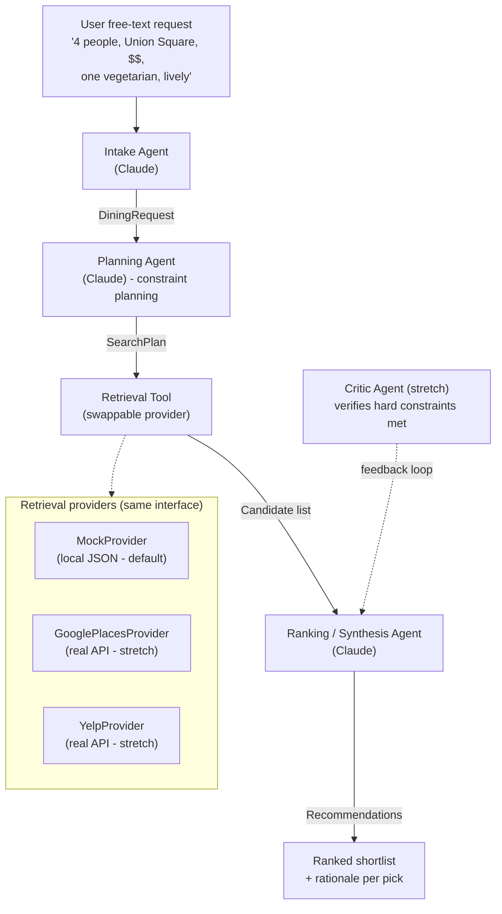

# GatherTable

> A multi-agent group dining planner. Reconciles everyone's preferences into a
> short, justified shortlist — instead of dumping a raw search list back at you.

<!-- TODO: replace with demo GIF -->
<p align="center">
  <em>(demo GIF goes here — record once the CLI is stable)</em>
</p>

---

## What it is

GatherTable helps anyone planning a meal together — two people or a group — agree
on where to eat by reconciling everyone's preferences. The hard problem is the
reconciliation, not the search.

Originally built in NYU's Large-Scale Web Application course (2019); rebuilt in
2026 as an agent-first system.

## Architecture

Four responsibilities, wired by a thin hand-written orchestrator (no LangGraph
— I want to own and explain the control flow). Retrieval sits behind a
swappable provider interface so the demo runs entirely on local mock data.



Agents pass **typed Pydantic models, not raw strings**: `DiningRequest`,
`SearchPlan`, `Candidate`, `Recommendation`. Each seam is independently
testable. See [`gathertable/contracts.py`](gathertable/contracts.py).

## More than a Yelp wrapper

The interesting problem is **reconciling conflicting preferences inside a
group** (one vegetarian, one wants steak, budget is `$$`, must be walkable
from Union Square). GatherTable models this as a constraint-satisfaction
problem:

- **Hard constraints** (dietary, budget cap) become filters that the
  retrieval layer enforces verbatim.
- **Soft preferences** (lively, walkable, good for groups) become weighted
  ranking criteria.
- The planning agent records each tradeoff in
  `SearchPlan.conflict_resolutions`, so the reasoning is auditable.

Retrieval — Yelp / Google Maps / a local JSON file — is just a data source
behind a swappable tool interface.

## Quick start

```bash
git clone https://github.com/<you>/gathertable && cd gathertable
python3.12 -m venv .venv && source .venv/bin/activate
pip install -r requirements.txt
cp .env.example .env  # then paste your ANTHROPIC_API_KEY in
python -m gathertable "4 people, Union Square, \$\$, one vegetarian, lively"
```

The MVP runs entirely on mock data (`data/restaurants.json`) and needs only
`ANTHROPIC_API_KEY`. Google Places / Yelp providers are stubbed.

CLI options:

```
--provider {mock,google,yelp}   # default: mock; google/yelp are stubs
--top-n N                       # default: 3
--verbose                       # print intermediate stage outputs
```

## Repo layout

```
gathertable/
  contracts.py            Pydantic models that flow between agents
  orchestrator.py         hand-written runner: intake -> plan -> retrieve -> rank
  cli.py                  rich-formatted CLI demo
  config.py               CLAUDE_MODEL constant + shared Anthropic client
  agents/
    intake.py             free text -> DiningRequest
    planning.py           DiningRequest -> SearchPlan
    ranking.py            (req, plan, candidates) -> Recommendations
    _structured.py        tool-use coercion helper, one retry on ValidationError
  tools/
    retrieval.py          Provider Protocol + MockProvider + Google/Yelp stubs
data/
  restaurants.json        ~15 NYC mock entries
tests/                    23 offline tests; FakeClient fixture in conftest.py
PLAN.md                   long-form design doc + decision log
```

## Design decisions

Short version:

- **Multi-agent over one big prompt** — each stage is independently testable
  and the failure modes are legible. Cost: more tokens and latency.
- **Typed Pydantic contracts** — free JSON schema for Anthropic tool-use, free
  retry hints from `ValidationError`, free test fixtures.
- **Hand-written orchestrator** — the control flow is linear; nothing to
  graph. The runner is short enough to read in one screen.
- **Swappable retrieval Protocol** — the agents don't know whether candidates
  come from a JSON file, Google, or Yelp.

The full reasoning (and the rationale-consistency bug that motivated the
Critic agent) lives in [`PLAN.md §6`](PLAN.md).

## Roadmap

Stretch items, in payoff order — see [`PLAN.md §5`](PLAN.md) for the full table
and [`PLAN.md §6.5`](PLAN.md) for the backlog:

1. Real **Google Places** or **Yelp Fusion** provider (keeping mock as default
   so the demo never breaks).
2. **Critic agent** self-check — verifies all hard constraints are satisfied
   and that rationales don't contradict each other; loops back if not.
3. Tiny **eval harness** — 5–10 scenarios + a rubric / LLM-as-judge score.
4. **Streamlit** UI.
5. **Solo mode** (1 preference + weighted random "spin") — different
   interaction from the group flow.
